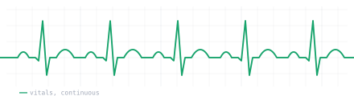
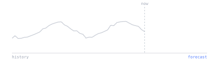
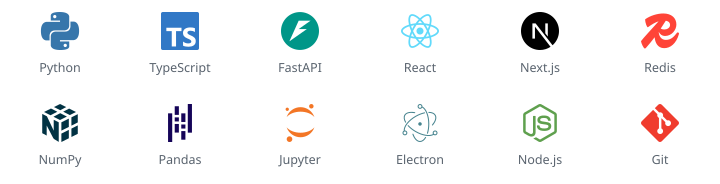

   

  

 

<picture>
<source media="(prefers-color-scheme: dark)" srcset="./assets/h-about-dark.svg"/>

</picture>

Physics trained me to model a system before touching it. Find the structure that governs it, then test the model against reality and watch where it breaks. Software rewards the same instinct, and it answers a lot faster than a telescope does. The first time I really trusted that instinct was pulling Hubble's constant out of raw observational data, which is mostly the discipline of separating signal from noise without fooling yourself. That same problem sits underneath everything I keep coming back to: machine learning, quantitative finance, and systems that have to stay standing under load.

Most of what I do now is architecture and building. A lot of what I do started as something nobody asked for, put together mainly to find out whether the idea would hold or just to see how far it would go.

 

 

<picture>
<source media="(prefers-color-scheme: dark)" srcset="./assets/h-building-dark.svg"/>

</picture>

I prototype constantly, most of it never sees daylight. Two things that made it far enough to be public:

<table>
<tr>
<td width="50%" valign="top">

 

<a href="https://www.kerfox.app">
<picture>
<source media="(prefers-color-scheme: dark)" srcset="./assets/kerfox-dark.png"/>

</picture>
</a>

<b><a href="https://www.kerfox.app">Kerfox</a></b> <em>Study that grows with you.</em>

 

A free revision platform for GCSE through to PhD. Animated lessons show the idea rather than state it, practice questions are marked against the official exam-board schemes, and an adaptive memory engine notices what you are about to forget and brings it back first.

<b>PLATFORMS</b> 
&nbsp; Web (PWA) &nbsp;&nbsp;&nbsp; &nbsp; Android
  
<b>BUILT WITH</b> 
&nbsp; React &nbsp;&nbsp;&nbsp; &nbsp; TypeScript &nbsp;&nbsp;&nbsp; &nbsp; Capacitor &nbsp;&nbsp;&nbsp; &nbsp; Supabase &nbsp;&nbsp;&nbsp; &nbsp; Cloudflare Workers &nbsp;&nbsp;&nbsp; FSRS
  
<b>STATUS</b> 

  
<b>LINKS</b> 
<a href="https://www.kerfox.app">Website</a> &nbsp;·&nbsp; <a href="https://github.com/EivanKolchin/kerfox-releases">Releases</a>

 

</td>
<td width="50%" valign="top">

 

<b><a href="https://aroundaxis.co.uk">Axis</a></b> <em>a small workspace app for teams.</em>

 

It brings opportunities, documents and real-time teamwork into one focused flow. An assistant drafts workflows and assigns tasks from plain English, a built-in scraper pulls leads straight into the pipeline, and docs, calendar, chat, brainstorm board and meetings stay in sync. Live analytics come from the actual work rather than a separate report.

<b>PLATFORMS</b> 
&nbsp; Windows &nbsp;&nbsp;&nbsp; &nbsp; macOS &nbsp;&nbsp;&nbsp; &nbsp; Android (Axis Go)
  
<b>BUILT WITH</b> 
&nbsp; React &nbsp;&nbsp;&nbsp; &nbsp; TypeScript &nbsp;&nbsp;&nbsp; &nbsp; TanStack Start &nbsp;&nbsp;&nbsp; &nbsp; Electron &nbsp;&nbsp;&nbsp; &nbsp; Capacitor &nbsp;&nbsp;&nbsp; &nbsp; Supabase &nbsp;&nbsp;&nbsp; &nbsp; Cloudflare
  
<b>STATUS</b> 
&nbsp; free for teams up to three
  
<b>LINKS</b> 
<a href="https://aroundaxis.co.uk">Website</a> &nbsp;·&nbsp; <a href="https://github.com/EivanKolchin/Axis-Releases">Releases</a>

 

</td>
</tr>
</table>

 

 

<picture>
<source media="(prefers-color-scheme: dark)" srcset="./assets/h-projects-dark.svg"/>

</picture>

<table>
<tr>
<td width="50%" valign="top">

**[The Wolf of Wall Street](https://github.com/EivanKolchin/The-Wolf-of-Wallstreet)**
 
AI-driven trading platform: parallel agents for market decisions and news monitoring, a risk-management layer, and a live dashboard. FastAPI and Redis on the backend, Next.js and TypeScript on the front end, with an LLM-assisted decision pipeline.
 
Python · TypeScript · FastAPI · Redis · Next.js

</td>
<td width="50%" valign="top">

**[Vitally](https://github.com/EivanKolchin/Vitally---Patient-Health-Management-Software)**
 
Patient health management software built for the Heidi Build 2025 Hackathon, helping patients navigate and stay on top of their own care.
 
TypeScript · React · Heidi Build 2025

</td>
</tr>
<tr>
<td width="50%" valign="top">

**[Estimating Hubble's Constant](https://github.com/EivanKolchin/Estimating-Hubbles-Constant)**
 
A university project deriving H₀ from observational data, worked through in Python instead of a lab notebook.
 
Python · NumPy · least squares

</td>
<td width="50%" valign="top">

**[Natural Gas Forecasting](https://github.com/EivanKolchin/Natural_gas_forecasting_with_ML)**
 
Forecasting natural gas prices with machine learning: time-series modelling on real market data.
 
Python · Pandas · time series

</td>
</tr>
</table>

 

 

<picture>
<source media="(prefers-color-scheme: dark)" srcset="./assets/h-stack-dark.svg"/>

</picture>

<picture>
<source media="(prefers-color-scheme: dark)" srcset="./assets/stack-dark.svg"/>

</picture>

 

 

<picture>
<source media="(prefers-color-scheme: dark)" srcset="./assets/h-stats-dark.svg"/>

</picture>

 

 

<picture>
<source media="(prefers-color-scheme: dark)" srcset="./assets/h-reach-dark.svg"/>

</picture>

 

